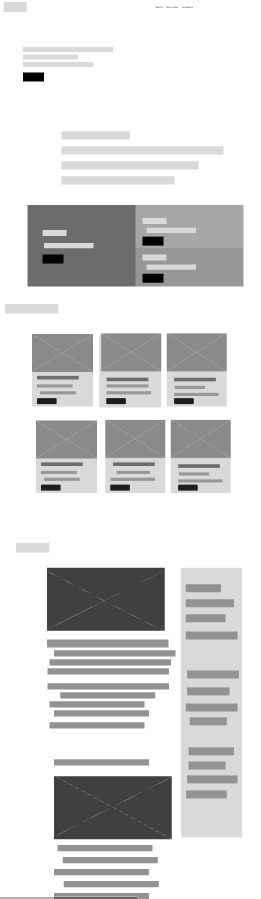
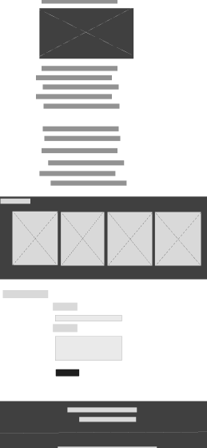
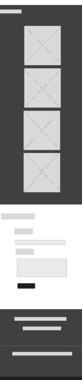

<h1 style="color:orange;">Nombre del Proyecto: Blogs.com</h1>

Blogs.com nace de la idea del camper Juan David Guiza Garcia, un entusiasta de la información, las noticias y los blogs en español.

<h2>Tema: Son Goku</h2>

El tema que elegí para este proyecto fue el de Son Goku, un personaje de la franquicia de Dragon Ball, el cual es un personaje icónico para todos nosotros. Un personaje que ha dejado una huella muy especial en nuestra infancia y, por lo tanto, quise traerlo a la memoria para este proyecto en especial.

<h2>Objetivo del Proyecto</h2>

Creación de una web informativa tipo blog moderno que tendrá el propósito de presentar artículos, de los cuales solo uno será sobre Goku. Esto haciendo énfasis en el tema que elegí anteriormente, por lo que este sitio web está orientado a informar sobre diferentes temas, pero en esta ocasión solo contendrá un solo artículo.

<h2>Cómo Está Compuesto el Sitio</h2>

El sitio está compuesto por los siguientes aspectos:

<h3>Home Page o Página Principal</h3>
<ul>
    <li>
        Header
        
El encabezado es algo muy importante para el sitio web en general, por lo que he decidido crear un encabezado para la página lo más simple y minimalista posible, siendo posible fijarlo en la parte superior de la página para que el usuario, al desplazarse hacia abajo, no pierda de vista la navegación entre las páginas.

    </li>
    <li>
        Banner
        
El banner es una parte muy importante para el sitio, ya que básicamente es la presentación del mismo. Dentro del banner, he incluido una referencia persuasiva acerca de la donación o aportación voluntaria hacia el sitio.

    </li>
    <li>
        Acerca de
        
El "Acerca de" o "About" en inglés es una parte fundamental y descriptiva de la página, ya que informa de qué trata el sitio. Por ello, he decidido introducir dentro de esta sección una descripción muy breve del sitio, junto a 3 paneles que redirigen a otras partes externas al home page o página principal.

    </li>
    <li>
        Noticias
        
Todos los blogs modernos en general poseen una sección de noticias que no he pasado por alto. He introducido dentro de esta sección un par de tarjetas que contienen una imagen y la descripción de la noticia, junto a un botón simple que redirige automáticamente al sitio de donde se toma la noticia.

    </li>
    <li>
        Contenido Principal
        
El contenido principal es la parte fundamental de un sitio web y, por lo general, habla de un tema en específico. En mi contenido principal, he introducido la información que tiene que ver con Goku, el tema que elegí.

    </li>
    <li>
        Artículos Referentes al Tema
        
Esta sección está compuesta por un par de tarjetas que, al darles clic, redirigen a otras partes del dominio de la página. Estas tarjetas se basan en el artículo o contenido principal, es decir, son una especie de referencia de lo que el usuario podría estar interesado en leer o estudiar.

    </li>
    <li>
        Sección de Comentarios
        
Los comentarios en los blogs o página hacen parte de la tradición y de la interacción habitual de usuarios que quieren compartir su opinión. Por eso, he introducido una sección de comentarios minimalista y poco saturada para la interacción de usuarios en mi página, aunque por el momento no es funcional, lo tendré en cuenta para más adelante.

    </li>
    <li>
        Footer o Pie de Página
        
El footer o pie de página es la sección final de la página como tal y es una parte fundamental. Al llegar al final de la página, es necesario mostrar algún tipo de información que resuma de qué trata la página, entre otros detalles. Para mi sitio, he introducido un footer sencillo y práctico que contiene una sección de iconos que redirigen a redes sociales, una breve descripción y, por último, los términos de privacidad y políticas de la página, aunque por el momento no son funcionales.

    </li>
</ul>

<h3>Error 404 o Página de Error</h3>

La página de error 404 es una parte fundamental de mi página, ya que algunas partes de la misma aún no han sido construidas. Básicamente, utilizo esta vista o página para comunicarle al usuario que la vista a la que hace referencia aún no ha sido construida.

<h3>Diseño</h3>

Para este proyecto, he optado por la implementación de un diseño minimalista que se integra armoniosamente en una paleta de colores compuesta por blanco, azul oscuro, fucsia en 2 tonalidades, violeta en 2 tonalidades y fucsia. Esta elección de colores ha sido cuidadosamente seleccionada para garantizar la simplicidad y la agradable estética, evitando la saturación de elementos visuales que podrían distraer al usuario y, en su lugar, maximizando la experiencia del usuario.

El uso del blanco como color principal proporciona un fondo limpio y fresco, que sirve como lienzo en blanco para presentar la información de manera clara y legible. El negro, por su parte, aporta un contraste elegante y ayuda a destacar elementos importantes dentro de las interfaces, lo que mejora la navegación y la comprensión de la información.

El toque de fucsia añade un elemento de sorpresa y vitalidad a las interfaces, sin embargo, se utiliza de manera moderada y estratégica para evitar la sobrecarga visual. Este color se reserva para resaltar elementos críticos, botones de acción o mensajes importantes, lo que aporta un acento visual y guía al usuario de manera efectiva a través de la aplicación.

El toque de azul oscuro añade un toque de elegancia al sitio, por lo que se proporciona de manera equilibrada y simple con los demás colores.

El toque de violeta genera en las interfaces un efecto agradable y sensaciones placenteras, ya que forma parte de un color pastel. El efecto visual que genera es elegante y simplemente bonito.

En conjunto, esta combinación de diseño minimalista y la paleta de colores se traduce en interfaces que no solo son atractivas a nivel estético, sino que también ofrecen una experiencia de usuario óptima al simplificar la interacción y mejorar la legibilidad de la información. La atención al detalle en el diseño de estas interfaces refleja nuestro compromiso con la satisfacción y comodidad del usuario.

<h3>Wireframes</h3>
<ul>
    <h4>Página Principal o Home Page - Versión Desktop</h4>
    <li >    
        
        
    <li>
    <h4>Página Principal o Home Page - Versión Móvil</h4>
    <li>
        
        
        
    </li>
</ul>

<h3>Conclusión del Desarrollador</h3>

El proyecto que desarrollé fue una experiencia de aprendizaje invaluable para mí. No solo me permitió avanzar en mis conocimientos existentes, sino que también reforzó algunas bases que había olvidado, especialmente en lo que respecta a la maquetación y el diseño de desarrollo orientado al front-end de una página web.

Durante el transcurso de este proyecto, pude sumergirme en el fascinante mundo del desarrollo front-end. Aprendí a trabajar con tecnologías y herramientas clave para crear interfaces de usuario atractivas y funcionales. Desde la estructura HTML hasta el diseño con CSS y un poco de interacción con JavaScript, adquirí una comprensión más sólida que al principio del proyecto, lo cual es de gran valor para mí.

<h3 align="left">Herramientas Utilizadas</h3>

    
    
    
    
    

<h5>Contacto:</h5>
<ul>
    <li>Email: juanguiza65@gmail.com</li>
    <li>Teléfono: 3118568900</li>
</ul>
